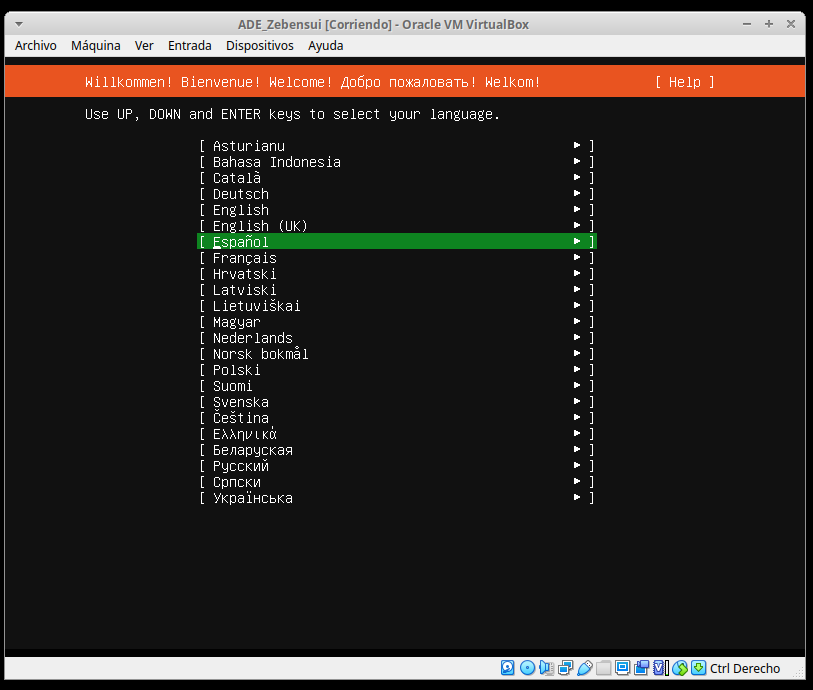
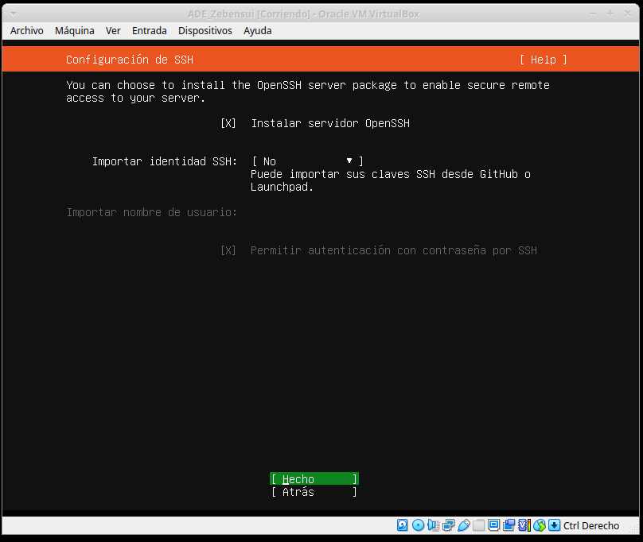

## Informe MySQL Server - Zebensui Lorenzo Esquivel

Lo primero es instalar el Ubuntu Server, con la configuración que nos piden que en este caso es instalarlo de forma normal con el opensssh.

Luego de esto instalamos el entorno gráfico que más nos guste, en mi caso fue xubunto-desktop y procedemos a instalar el servidor MySQL.

Comprobamos la versión y el estado del servicio, lo apagamos lo encendemos y vemos que todo funciona correctamente.

Ahora vamos a comprobar que no entra al mysql con el usuario root aunque le pongamos bien la contraseña y posteriormente lo vamos a arreglar con los comandos que vemos a continuación.

Nos descargamos el WorkBench, lo abrimos para comprobar que funciona e importamos una base de datos para ver que todo funciona correctamente. En mi caso use la de jardinería.

Nos instalamos adminer.

Ahora ejecutamos el comando php para que cree el archivo adminer con la correspondiente versión.

Lo siguiente que tenemos que hacer es crear el fichero de configuración de adminer en apache y meter dentro la siguiente linea

Solo nos queda guardar los cambios, reiniciar el servicio y confirmar la conexión de local host por el alias que le hemos configurado

Lo último que nos falta es instalar es el PhPMyAdmin que nos va preguntando ciertas cosas durante la instalación pero con dejarlo todo como veremos a continuación es suficiente.

## Preguntas finales:

Directorio de instalación.

Lo que pasa con el comando es que suspende el servicio:

Directorio del servidor

Directorio de los datos

Archivo de configuración:

Propietario de las bases de datos:

